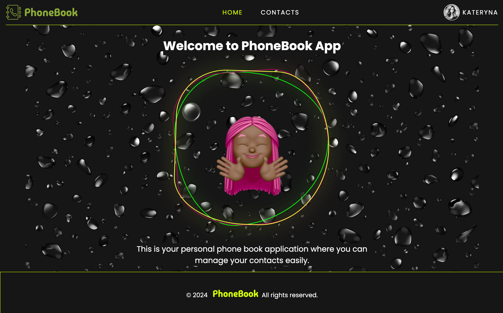
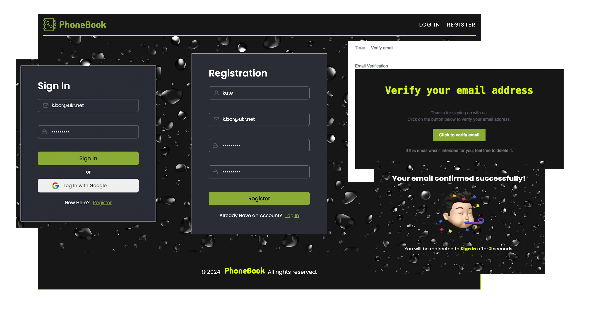
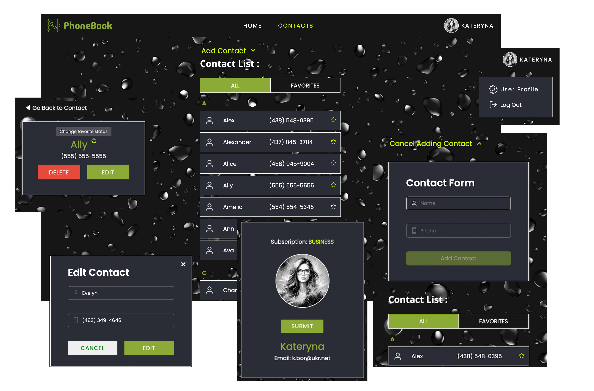

# PhoneBook App

<p>
    
    
    
    
    
    
    
    
    
    
    
    
    
</p>





## Features

- User authentication
- Email verification
- CRUD operations for contacts
- Sorting and grouping contacts
- Filtering
- Adding to favorites
- Uploading user avatar

## Usage

```
Sample User Login

Email: k.bor@ukr.net
Password: Qwe12345!

```

### Run

```
# Run frontend (:3000)
npm start

# Run backend backend (:5000)
npm run dev
```
